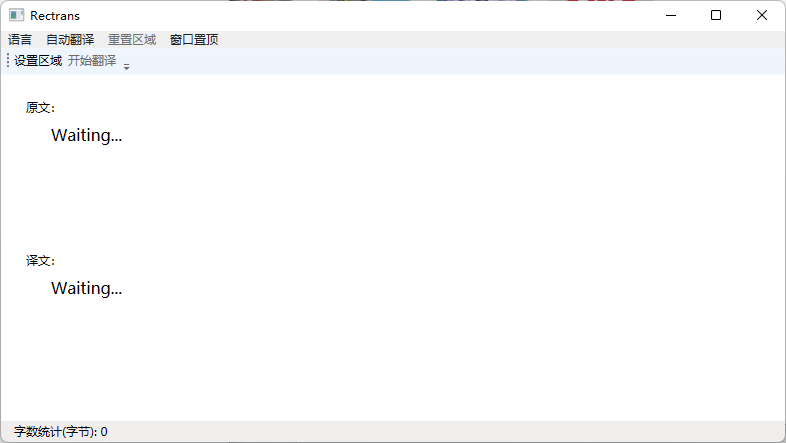
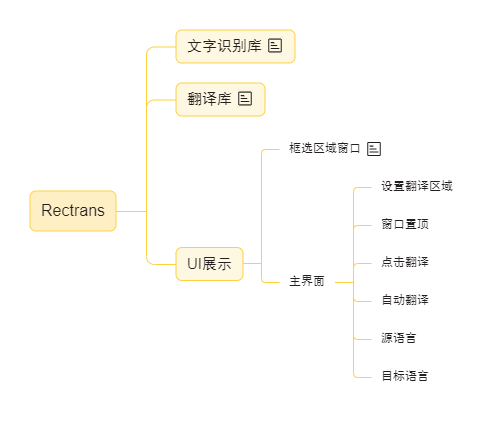

# :sparkles: :heart: Rectrans :heart: :sparkles:

### :unicorn: 一款机翻软件

采用设置一个矩形区域的做法进行文字识别，将识别出的文字进行翻译。不需要`hook`，基本适用于所有类型的游戏文本翻译。

> Tips：你可以用于：`Subverse` `最终幻想14 FINAL FANTASY XIV（国际服）` `上古卷轴 The Elder Scrolls Online` 等游戏。

### 当前功能：

1. 框选矩形翻译区域进行翻译。
2. 提供`英语`→`简体中文`的翻译。
3. 主窗口置顶按钮。
4. 原文展示窗口。
5. 译文展示窗口。

### 后续上线功能：

1. 提供更多语言翻译。
2. 自动翻译功能实装（按照设定的时间间隔进行翻译）。
3. 提供矩形翻译区域使用译文覆盖原文功能。
4. 字体设置功能。

### 主程序

### 预览图

### 思维导图

### README.md

[简体中文](README.md)

[English](README.en.md)
